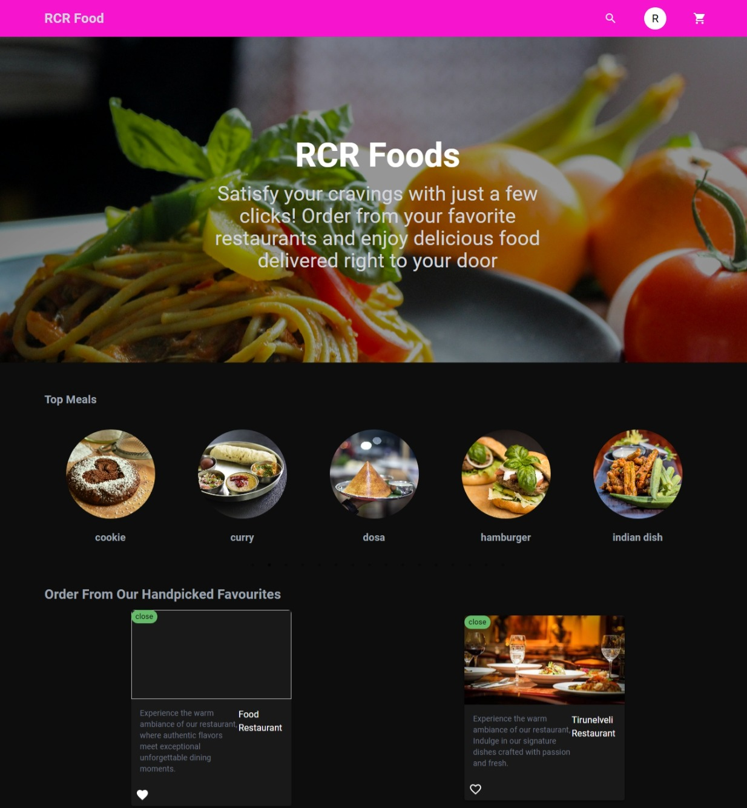
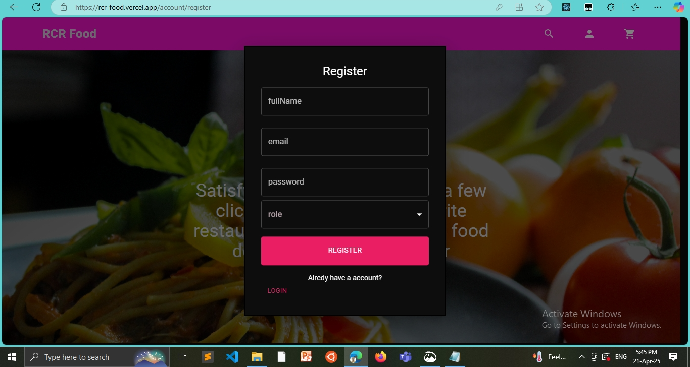
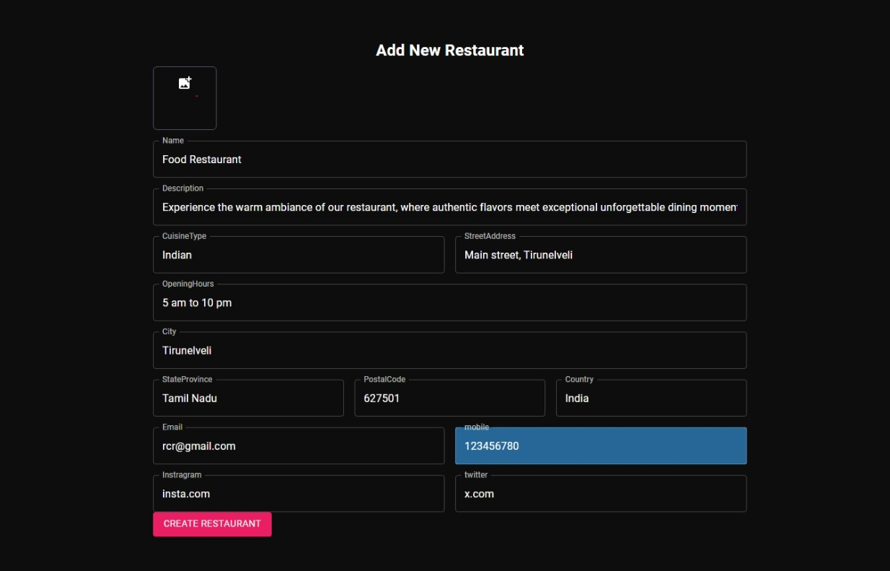
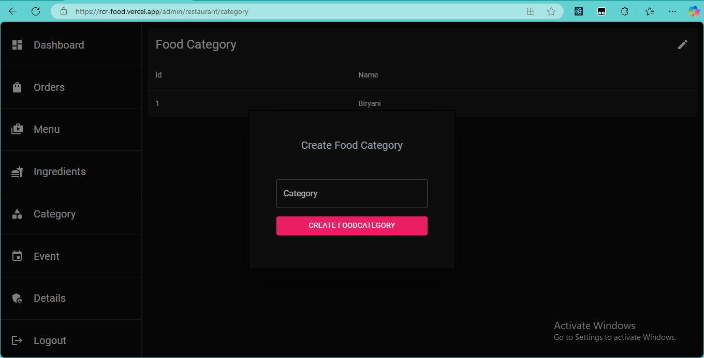
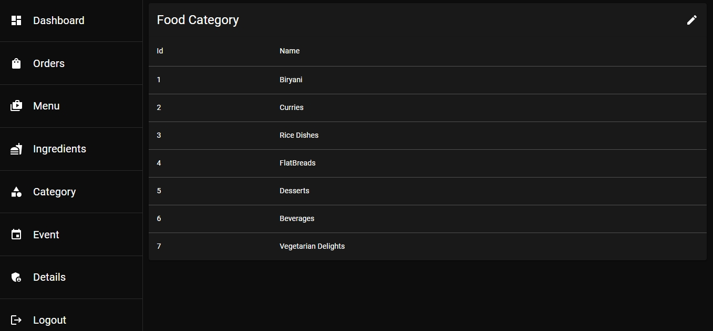
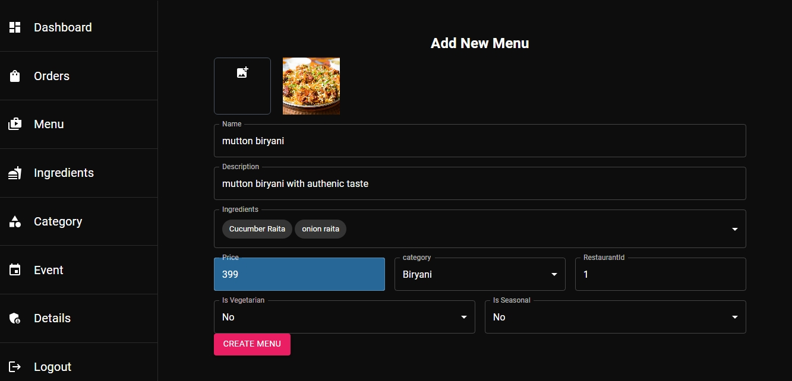
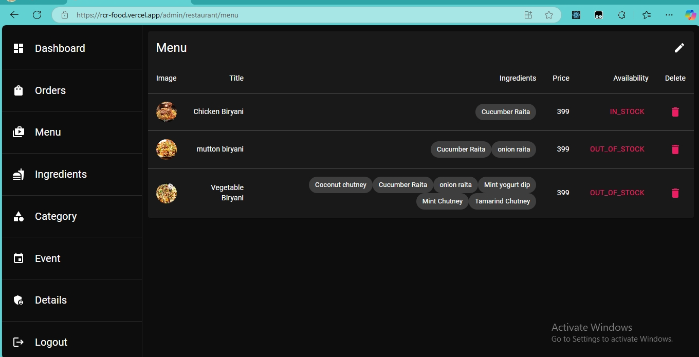

# 🍽️ Food Ordering Platform for Restaurants

## 📌 Project Overview
This is a full-stack food ordering application built using **Spring Boot** for the backend and **React** for the frontend. The platform enables **restaurant owners** to manage orders, menus, and customer interactions efficiently and customers who can buy delicious foods by sitting in thier home.

## 🚀 Tech Stack
- **Frontend:** React, Redux, Material-UI, Tailwindcss, Axios, Javascript
- **Backend:** Spring Boot, Java, MySQL
- **Authentication:** JWT
- **Payment Gateway:** Stripe
- **Deployment:** Docker

## 🎯 Features for Restaurant Owners
### ✅ **Menu Management**
- Add, update, and delete menu items.
- Categorize menu items (Starters, Main Course, Desserts, etc.).
- Upload images for dishes.

### ✅ **Order Handling**
- View incoming customer orders in real-time.
- Update order status (Received, Preparing, Ready, Delivered).
- Notify customers of order updates.

### ✅ **Analytics & Reports**
- Track daily/weekly sales reports.
- View most ordered items.
- Customer feedback and ratings analysis.

### ✅ **Admin Dashboard**
- User authentication & role management.
- Set discounts and promotions.
- Manage restaurant profile and working hours.

## 📸 Screenshots for the understanding of the restaurant owners
_(Replace the placeholders below with actual screenshots)_

### 📍 HomePage


### 📍 Create the Account as Restaurant owner Using this Form


### 📍 Create the Restaurant Using this Form


### 📍 Create the Food Ctegory Using this Form



### 📍 Create the MenuItem Using this Form




<!-- ### 📍 Menu Management


### 📍 Order Processing


### 📍 Reports & Analytics
 -->

<!--## 🛠️ Installation & Setup
### 🔹 **Backend (Spring Boot)**
1. Clone the repository:
   ```sh
   git clone https://github.com/yourusername/yourrepo.git
   cd backend -->
